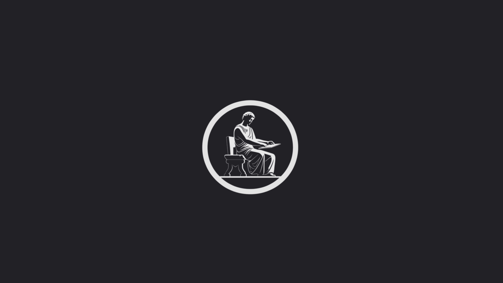

  
   

  <h3><b>Sociedad Secreta del Ritmo</b></h3>

<!-- TABLE OF CONTENTS -->

# 📗 Table of Contents

- [📖 About the Project](#about-project)
  - [🛠 Built With](#built-with)
    - [Tech Stack](#tech-stack)
    - [Key Features](#key-features)
  - [🚀 Live ](#live)
- [💻 Getting Started](#getting-started)
  - [Setup](#setup)
  - [Prerequisites](#prerequisites)
  - [Install](#install)
  - [Usage](#usage)
  - [Run tests](#run-tests)
  - [Deployment](#deployment)
- [👥 Authors](#authors)
- [🙏 Acknowledgements](#acknowledgements)
- [❓ FAQ ](#faq)
- [📝 License](#license)

<!-- PROJECT DESCRIPTION -->

# 📖 Sociedad Secreta del Ritmo 

**S.S.R.** official website repo.

## 🛠 Built With 

- HTML
- CSS
- JavaScript

### Tech Stack 

In this project was only used HTML and CSS.

<!-- Features -->

### Key Features 

- **Semantic HTML**
- **CSS**
- **Responsive Design**
- **DOM**
- **Linters**

(<a href="#readme-top">back to top</a>)

<!-- LIVE  -->

## 🚀 Live  

- access [sociedad secreta del ritmo](https://sociedadsecretadelritmo.netlify.app/)

(<a href="#readme-top">back to top</a>)

<!-- GETTING STARTED -->

## 💻 Getting Started 

To get a local copy up and running, follow these steps.

### Prerequisites

In order to run this project you need:

- VS Code or an IDE
- NodeJS
- Git
- GitHub account

## Setup

Clone this repository to your desired folder:

1. Click the green "Code" button and copy the repository URL.

2. Open a terminal window and navigate to the directory where you want to clone the repository.

3. Type "git clone" in the terminal window, followed by a space and then paste the repository URL https://github.com/rudicarrilloypr. Press "Enter" to clone the repository.

4. Verify that the repository has been cloned successfully by checking the contents of the directory where you cloned it.

5. That's all, you have the code!

### Install

Installation not required.

### Usage

Edit the code using VS Code or an IDE.

### Run tests

Test don't required.

### Deployment

You can deploy this project using your preferred deployment method. However we recommend using GitHub Pages link given in the project's description or in the Live Demo section.

(<a href="#readme-top">back to top</a>)

<!-- AUTHORS -->

## 👥 Authors 

👤 **Rudi Carrillo**

- GitHub: [@rudicarrilloypr](https://github.com/rudicarrilloypr)
- Twitter: [@onlyargo](https://twitter.com/onlyargo)
- LinkedIn: [Rudi Carrillo](https://linkedin.com/in/rudi-carrillo)
- Instagram: [@__rudicarrillo](https://www.instagram.com/_rudicarrillo/)

(<a href="#readme-top">back to top</a>)

<!-- ACKNOWLEDGEMENTS -->

## 🙠Acknowledgments 

 Thanks to the SSR team for the opportunity to work on this project.

(<a href="#readme-top">back to top</a>)

<!-- FAQ (optional) -->

## ❓ FAQ (OPTIONAL) 

- **How do I set up the project?**

  - Clone the repository from GitHub.

- **How can I contribute to the project?**

  1. Fork the repository on GitHub.
  2. Create a new branch for your changes using git checkout -b my-feature-branch.
  3. Make your changes and commit them with descriptive commit messages.
  4. Push your changes to your forked repository.
  5. Submit a pull request to the original repository.
  6. Wait for feedback and iterate on your changes as needed.

(<a href="#readme-top">back to top</a>)

<!-- LICENSE -->

## 📠License 

This project is [MIT](./LICENSE) licensed.

(<a href="#readme-top">back to top</a>)

